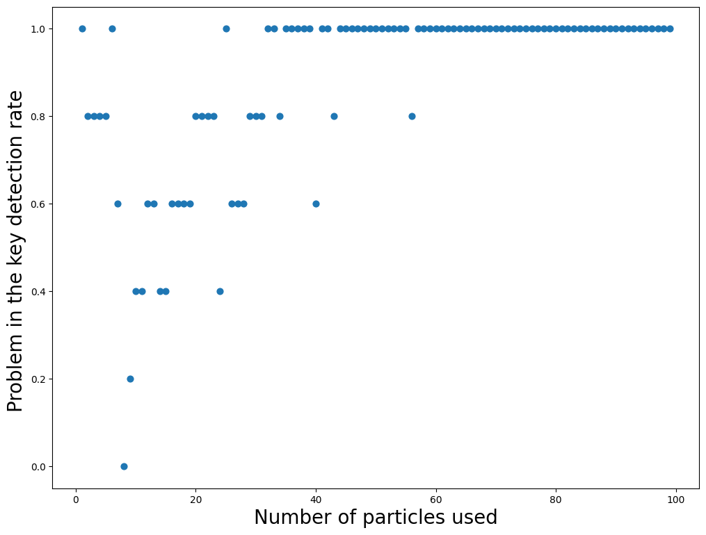

# BB84 simulation
This repository contains a simulation of the quantum cryptographic protocol BB84. This protocol is used to create and share a safe cryptographic key making use of unique quantum properties. For more details see the section below on the protocol. 

This simulation is designed for didactic use, therefore the program will not only simulate the steps of the protocol, but will also explain them to the user. Running the simulation multiple times with different parameters can also show the dependance of the safety of the protocol on the number of qubits used.
# How to use the simulation
**Required packages**:
- [simulation.py](https://github.com/GiorgioTassinari/BB84-Simulation/blob/main/simulation.py) : numpy, pandas
- [graph.py](https://github.com/GiorgioTassinari/BB84-Simulation/blob/main/graph.py) : matplotlib
- [test_simulation.py](https://github.com/GiorgioTassinari/BB84-Simulation/blob/main/test_simulation.py) : hypothesis

**What to do**

0) Have Python installed on your sistem. If you don't, refer to [here](https://www.python.org/downloads/)
1) Download the files you want to use from the repository. The more interesting ones are [simulation.py](https://github.com/GiorgioTassinari/BB84-Simulation/blob/main/simulation.py) and [graph.py](https://github.com/GiorgioTassinari/BB84-Simulation/blob/main/graph.py)
2) Verify that you have the required packages to run the files you want to use. If you don't have them, you can install them by using the following command on your terminal, then changing numpy with the name of the others packages you need
```console
pip install numpy
```
3) Use the command cd of the terminal for accessing the folder where you downloaded the files. Now the following command you can run the files
```console
python simulation.py
```
4) Try both the simulation and the graph. They run with default parameters and explain themselves what they're doing
5) If you want to run specific functions, or run the simulation or create a graph with different paramaters, you can directly call specific functions using the -c argument after calling python.\
For example, with the following command it's possible to run the simulation using only 10 particles for creating the key

```console
python -c 'import simulation; simulation.run(n=10)'
```
**What interesting parameters can be chosen**
- The 'run' function in the [simulation.py](https://github.com/GiorgioTassinari/BB84-Simulation/blob/main/simulation.py) file takes 5 optional parameters
    - <u>n</u>: integer that defaults to 1000, is the number of particles that will be sent between Alice and Bob to create the key. Is expected to be positive.
    - <u>sender</u>: string that defaults to "Alice", can change the name used during printing on the terminal for the sender
    - <u>receiver</u>: string that defaults to "Bob", changes the name in the same way for the receiver
    - <u>eavesdropper</u>: string that defaults to "Eve", changes the name in the same way for the eavesdropper
    - <u>eavesdropping</u>: bool that defaults to False, is the value that determines whether or not Eve is present in the simulation. If this value is kept False, the simulation ends in success, since Alice and Bob create a safe shared key without intrusions. If it's set to True, during the key comparison they will probably notice Eve's eavesdropping, if the number of particles used is sufficiently high.
- The 'simulate_and_graph' function in the [graph.py](https://github.com/GiorgioTassinari/BB84-Simulation/blob/main/graph.py) file takes 2 optional parameters
    - <u>runs</u>: int that defaults to 5, how many times the simulation will be run each time to calculate a key problem detection rate. The higher this value, the more accurate the detection rate will be. It will also slow down the calculation because the simulations will have to be repeated 'runs' time each.
    - <u>particle_max</u>: int that defaults to 100, is the max range of particles used on the repeated simulations. The first simulation will use only 1 particle, then the next one will use one more, up to the value of 'particle_max'. A value between 50 and 100 is recommended, because a lower value will not show the detection rate reach 1, and a higher value will slow down the simulation significantly without any substantial advantage as the detection rate already reached 1. It's possible to have high value for 'runs' and a lower value for 'particle_max' to see a more accurate initial curve.

**An example of a graph done with default settings**


# BB84 protocol
The BB84 is a protocol to distribute a safe criptographic key using quantum mechanical properties, developed by Charles Bennett and Gilles Brassard in 1984. It was the firts quantum cryptography protocol ever designed. It's a method to securely communicating a private key formed by a random sequence of zeros and one from one person to another. This not possible using classical phisics methods, as it's always possible that key may be intercepted during transmission without the two people now knowing. Quantum mechanics instead makes the creation of such a secure key possible. Understanding how this protocol works also allows to graps the uniqueness and potential of quantum mechanics in techonological, computational and cryprographic applications.

The protocol works in the following way: particles with spin 1⁄2 are sent from a person, let's call her Alice, to the intended receiver of the message, let's call him Bob. Before sengin the particles, Alice prepares each of them in a spin-state that is either spin-up (coded in binary as 1) or spin-down (coded in binary as 0) in either one of two different orthogonal axes, in our case the horizontal one X and the vertical one Z. We'll refer to these as the base on which the measurement is done (horizontal/X or vertical/Z). The preparation is done by using a Stern-Gerlach apparatus, which creates a magnetic field alighed in a chosen direction.


For spin 1/2 particles, the particles separate into two discrete streams, one deflected in the positive direction (we'll code this a bit of value 1), one deflected in the negative direction (coded as a bit of value 0). By orienting the Stern-Gerlach along the two orthogonal axes X and Z it's possible to decide in which base each measurement is done. The measurements done by Alice are always done randomly chosing the base, and the results are always randomly either 1 or 0. The states |↑> and |↓> along the Z axis are consideread as 1 and 0 outcomes, and |+> and |-> in the X directionas are considered with outcomes of 1 and 0 respectively. Now she has two strings, one of bases she chose and one of the results she got. She sends each particle to Bob, who is also equipped with a Stern-Gerlach apparatus. Bob too notes the series of X or Z and the relative valus of 0 or 1 for each particle sent by Alice. Because of the behaviour of quantum particles when passing through a Stern-Gerlach apparatus they know that their outcomes are always equal when they both happened to choose the same base. If they instead chose two different bases, Bob's result will be random.

After completing the measurements, they publicly share whith each other the complete list of bases used for the measurements. Comparing these, the keep only those values for which their bases were the same. This new and shorter list of bits is going to be their shared key. Alice and Bob then exchange a certain number of random bits of their key to check for errors. If there is no error, everything went correctly, and they use some cryprographic tecnique to share their message using the shared key known only to them.

If they found errors the key is not safe because it means someone eavesdropped. This person, let's call her Eve, tried to intercept the particles with her own Stern-Gerlach apparatus. She puts herself between Alice and Bob to incercept the key, but she doesn't know what bases Alice or Bob are choosing, so she can only guess. When she guesses wrong, the direction of the spin of the particle changes. So, when Bob does his measurement, it's possibile that he chooses the same base as Alice, but not the same as Eve. In doing so, he now only has a 50% chance of getting the same result as Alice. The other 50% of the time there is a mismatch between the results of the mearument done by Alice and Bob, and they can infer someone is eavesdropping, therefore they will not use the key which is not safe.

# Logic of the project
- The file [simulation.py](https://github.com/GiorgioTassinari/BB84-Simulation/blob/main/simulation.py) contains all the functions to simulate the BB84 protocol. Alice chooses random bases X and Z and gets random results 0 and 1. These are saved in a DataFrame. This is sent to Bob that does a measurement, creating a new DataFrame to store the information, and in the process modifying the state. If eavesdropping is turned on, before this Eve does a measurement, and she sends to Bob the DataFrame she obtained instead, emulating the interefence she would case in real life. Then a function compares the bases of Bob and Alice, saving the indexes when these match, emuluting the process of creating the shared key. In the end a function emulates the sharing of certain bits of the key by comparing the values in Alice's and Bob's DataFrames in the indexes saved by the previous function. The comparison ends showing how many matches were found, and if an eavesdropper was detected.\
Throughout this processs the functions tell the user what is happening, and show part of the relevant results by printing on the terminal.
- The file [graph.py](https://github.com/GiorgioTassinari/BB84-Simulation/blob/main/graph.py) imports [simulation.py](https://github.com/GiorgioTassinari/BB84-Simulation/blob/main/simulation.py) and can execute the simulation a desired amount of times. The simulation in this case is always run with eavesdropping turned on. By repeating the simulation a lot of times with the same amount of particles used it's possible to measure 'empirically' how many times the simulation was able to recognize the presence of Eve. Then, by varying the amount of particles used each time, it's possible to create a graph that shows how many particles are needed to be able to reliably detect Eve. It's also possible to see that by using too few particles it's impossible to generate any key.
- The file [test_simulation.py](https://github.com/GiorgioTassinari/BB84-Simulation/blob/main/test_simulation.py) contains all the test used to test various properties of all the functions necessary to run a single simulation. Hypothesis strategies are used in the tests.
